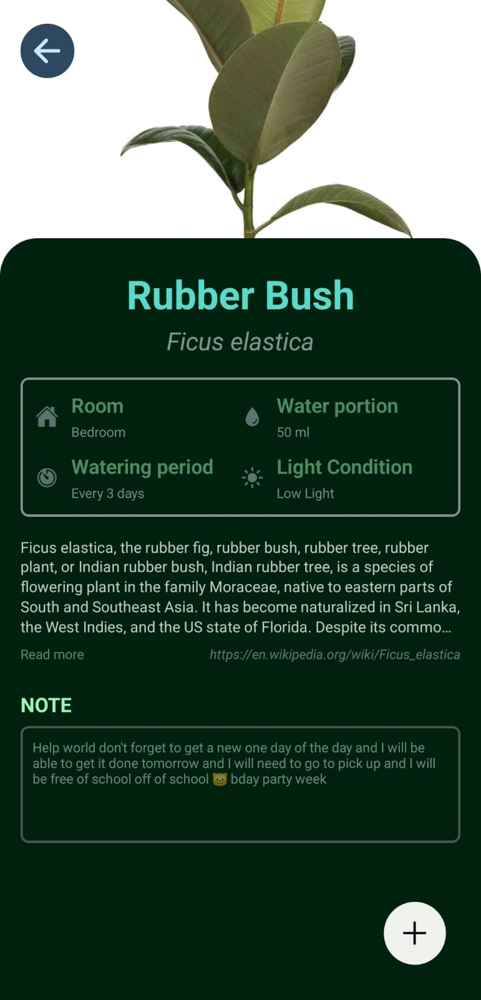
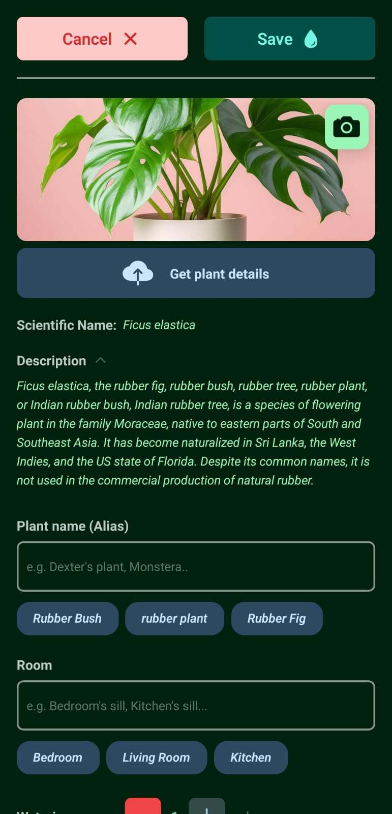
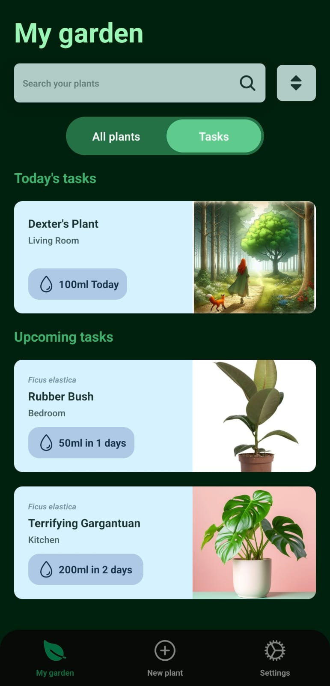
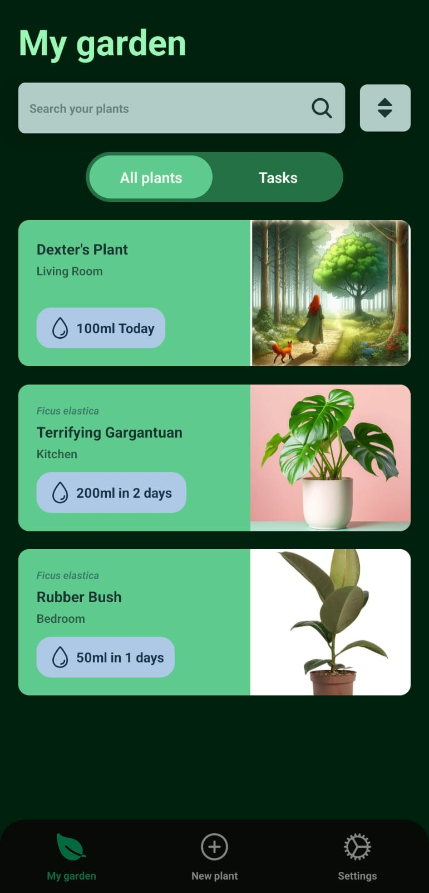

# Garden

A water reminder app, that helps to keep track of the user's plants. Uses Plant.Id to get the AI assisted information on plants based on an image provided. 


## Tech Stack

- Expo 50
- React Native
- Nativewind
- TailwindCSS
- React Hook Form
- Zustand
- Reanimated
- React Native Skia
- Drizzle
- SQLlite
- Zod

## Screenshots

  
 


## Environment Variables

To run this project, you will need to add the following environment variables to your .env file

`EXPO_PUBLIC_API_URL=https://plant.id/api/v3`

`EXPO_PUBLIC_API_KEY` Get your api key from https://web.plant.id/plant-identification-api/ 


## Run Locally

Clone the project

```bash
  git clone https://github.com/amilmohd155/RNGardenApp.git
```

Go to the project directory

```bash
  cd RNGardenApp
```

Install dependencies

```bash
  npm install
```

Start the server

```bash
  npm run start
```

